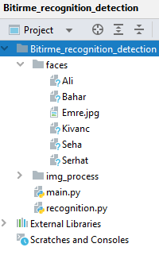

# Face-Recognition-Safe-and-Dangerous-Area-detection
The faces to be identified should be added to the folder called faces.

A folder named img_process should be created to save the detected faces in the same directory.
